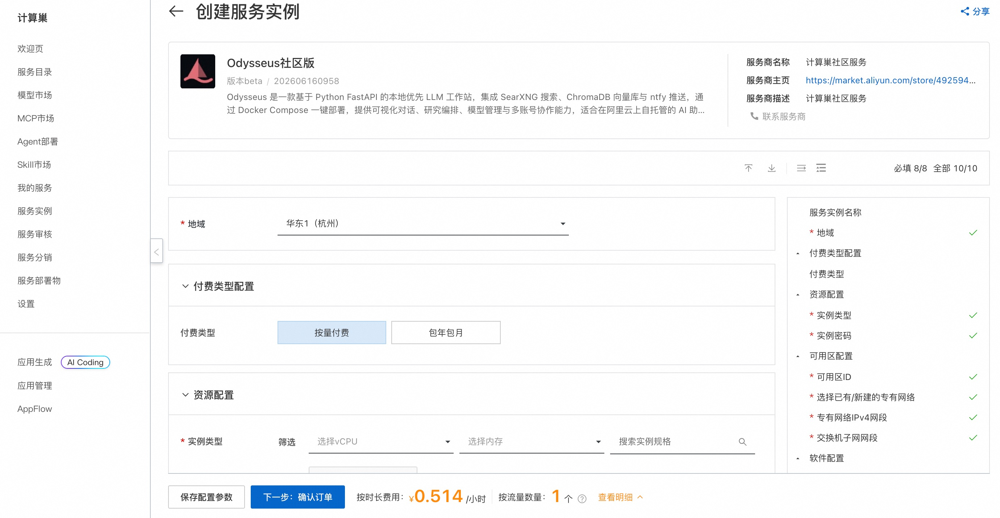
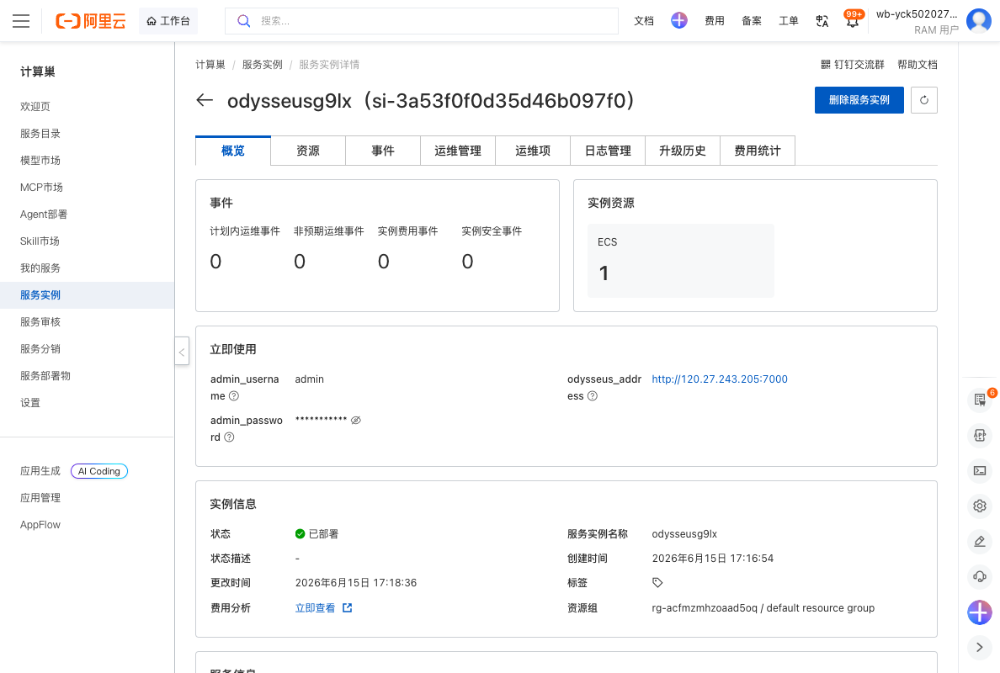
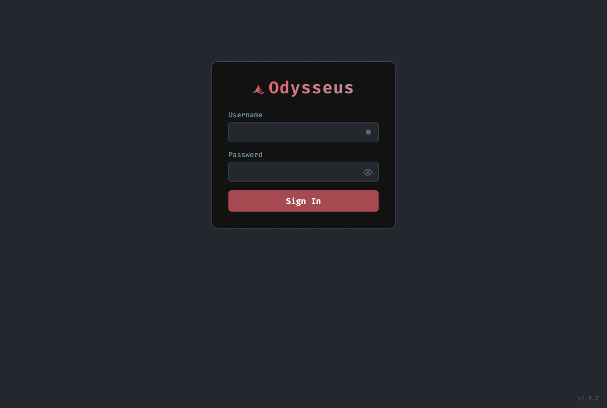

# Odysseus社区版 部署文档

## 概述

Odysseus 是一款轻量级的开源服务，提供基于 Web 的管理与登录入口（默认监听 7000 端口）。通过阿里云计算巢服务，您可以快速部署 Odysseus 社区版，实现开箱即用，部署完成后即可通过控制台直接获取访问地址、管理员账号与密码。

## 部署流程

### 1. 创建服务实例

访问 Odysseus 社区版 服务部署链接，按提示填写部署参数：

[部署链接](https://computenest.console.aliyun.com/service/instance/create/cn-hangzhou?type=user&ServiceId=service-1826a8af63764c00bce8)

### 2. 确认订单并创建

参数填写完成后可以看到对应询价明细，确认参数后点击 **下一步：确认订单**。确认订单完成后同意服务协议并点击 **立即创建** 进入部署阶段。

### 3. 等待部署完成

等待部署完成后进入服务实例管理，在控制台找到 Odysseus 社区版 访问链接（`odysseus_address`）以及管理员账号（`admin_username`）和登录密码（`admin_password`）。

### 4. 访问服务

单击 `odysseus_address` 链接访问服务，使用控制台输出的管理员账号和密码登录即可。

## 官方文档

更多信息请访问官方文档：[Odysseus 官方仓库](https://github.com/pewdiepie-archdaemon/odysseus)

### 使用须知
本工具都为第三方开源项目，阿里云仅提供云资源和部署入口支持，不对工具自身功能、生成内容、执行结果、服务可用性及额外费用承担责任。